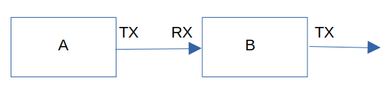

# Pico How Do I
Some tips for me, myself and I, and everyone who wants to use them. Mostly Micropython, some about hardware.


## Contents:
- The never remembered instructions
- External powering
- Non blocking structure for timing in loops
- Difference between UART in Micropython and in Python on the PC
- Daisy chaining serial informations
- Validating serial tabular data

## The never remembered instructions
This automatically starts the main_loop function when the module is started as a program.  
When used as a module it only provides the defined functions (like main_loop that can be started from a terminal after the module is imported)

```python
def main_loop():
    while True:
        # do a lot of things

if __name__ == '__main__':
    main_loop()
```

## External powering
When using sensors it is often better to use a stabilised 5V source.
This can be connected via Schottky diode (like BAT46) to the VSYS pin (pin39).
To have the desired program start automatically at powerup, put "import myprogram" into the file main.py.


## Non blocking structure for timing in loops
This example shows how to display output values  that are periodically measured,  
with different timings and without a sleep functions that blocks in the main loop.
In addition it provides nbsecs that is incremented every second.


```python
#....

# Timing intervals:
interval_oled = 100
interval_print = 1000
interval_uart = 500


# Initialize timings:
now = time.ticks_ms()
last_oled = now
last_print = now
last_uart = now
last_second = now

nbsecs = 0

# main loop:
while True:

    now = time.ticks_ms()
    measure()

    # every second:
    if time.ticks_diff(now, last_second) >= 1000:
        last_second = now
        nbsecs += 1

    # print
    if time.ticks_diff(now, last_print) >= interval_print:
        led.value(1)
        print_values()
        last_print = now
        led.value(0)

    # oled
    if time.ticks_diff(now, last_oled) >= interval_oled:
       last_oled = now
       oled_values()

    # uart 
    if time.ticks_diff(now, last_uart) >= interval_uart:
        last_uart = now
        uart_values()

    # ...
```

## Difference between UART in Micropython and in Python on the PC
While developing a data reception program first on the PC, thaen on the Pico, I stumbled over some differences.
Two small programs show them:

####Python on a PC:
Here the readline function is blocking until a line is received.
```python
import serial
uart = serial.Serial('/dev/ttyUSB0', baudrate=9600)

while True:
    s = uart.readline()
    s = s.decode('latin-1')
    print(s)
```

####Micropython:
Here the readline function is non blocking, which has the advantage that we can also do other things in our while loop.  
But we have to check if there are incoming data.
```python
from machine import UART, Pin
uart = UART(0, baudrate=9600, timeout = 10, tx=Pin(0), rx=Pin(1), timeout_char = 10)

while True:
    s = uart.readline()
    if s:
        s = s.decode('latin-1')
        print(s)
```


## Daisy chaining serial informations



I prefer my measuring data travelling through cables under my control instead of going I don't know where into clouds or through WLAN.  
But then I have the problem that there are multiple serial outputs that should be bundled  into one for treatment, maybe by Home Assistant.
My data are usually text outputs that are tab separated for different values and terminated by a line feed.
The advantage is that I can easily plot them.

My solar stepup converter (module A) could for example output this:
```  
A	28996357	48.9	9.77	478	0.42	1158146	33.6	28.5	34.8	30.2	813	0	931.3946
A	28996359	48.82	9.82	479	0.42	1158146	33.7	28.7	35.1	30.2	813	0	954.4613
A	28996361	48.74	9.83	479	0.42	1158147	33.8	28.8	35.3	30.2	813	0	977.5269
```

whilest a double 100A Ampèremeter (module B) outputs values like this:

```  
60	-0.07	0	0.017	-0.007	0	0	4.82
62	-0.07	0	-0.023	-0.007	0	0	4.82
63	-0.07	0	0.044	-0.007	0	0	4.83

```

I want them fitted together like this:

```  
A	28996357	 ...    931.3946	60	-0.07	0	0.017	-0.007	0	0	4.82
A	28996359	 ... 	954.4613    62	-0.07	0	-0.023	-0.007	0	0	4.82
A	28996361	 ... 	977.5269    63	-0.07	0	0.044	-0.007	0	0	4.83

```

Module A outputs its values continuously every 2s.
Module B has a jumper to select between continuous output (for debugging) or output on demand, every time module A outputs a new line character.

```python
#....

uart = UART(0, baudrate=9600)
jmp_uart = Pin(2, Pin.IN, Pin.PULL_UP)

while True:
    
    #...
        
    # uart continuously when jumper set:
    if jmp_uart.value() == 0:
        if time.ticks_diff(now, last_uart) >= interval_uart:
            last_uart = now
            uart_values()
    
    else:       
        # jumper not set: uart values on demand, daisy chain with incoming data
        if uart.any():
            s = uart.read()
            
            if  '\n' in s:
                s = s.rstrip()
                uart.write(s + '\t\t')
                
                uart_values()
            else:
                uart.write(s)
    # ...
```

## Validating serial tabular data

As described above my data mostly consist of tab separated lines. This works quite well, but sometimes data are corrupt and the receiving program hangs. So I spent some time analizing the problem and finding solutions. The following functions are tested on a PC, they should mostly also work in Micropython, see chapter on differences.

### Decoding errors
If data are decoded from bytes to string as UTF-8 they may contain illegal bytes. This can be handled with try - error.
The following function returns an empty string if there is an error, otherwise it decodes the bytes normally:

```python
def readline(uart):
    s = uart.readline()
    try:
        s = s.decode('utf-8').strip()
    except:
        s = ""
        print("# Decode error")
    return s
```
This can be done even more simple if there are only ASCII bytes coming in:
```python
def readline_ASCII(uart):
    s = uart.readline()
    s = s.decode('latin-1').strip()    # no decode errors possible 
    return s
```
'latin-1' (also known as ISO-8859-1) maps every byte (0–255) directly to the first 256 Unicode code characters, so it will never raise a UnicodeDecodeError.

### Data validation
The next step is to validate the decoded string. In my case it starts with a capital letter (or letters) followed by tab (or spaces) separated numbers.
The following function checks the incoming string and returns it as is. In case of an error it returns an empty string,
If your data are different, you can easily adapt this function.

```python
def check_line(line, nbcols):
        
    # Also accept spaces as separation and convert them to tabs:
    line = spaces_to_tab(line)
    
    # Return comment lines starting with '#' as they are
    if line.startswith('#'):
        return line
    
    # Return empty string for empty lines:
    if not len(line):
        return "" 
    
    # Remove trailing newline and split by tab
    parts = line.rstrip('\n').split('\t')

    # Check column count
    if len(parts) != nbcols:
        return ""

    # Check first column 
    first_col = parts[0]
    if not first_col.isupper():
        return ""

    # Check if remaining columns are numeric
    for col in parts[1:]:
        try:
            float(col)  # Works for both int and float
        except ValueError:
            return ""
    # Valid:
    return line  
```
The function uses a small helper function to convert spaces to tabs if necessary:
```python
def spaces_to_tab(line):
    chunks = line.split() 
    return '\t'.join(chunks)
```
Sometimes when testing I was not sure any more how many columns my data had. This funtion helped a lot:
```python
def guess_nbcols(uart):
    print("Guessing number of columns in data:")
    for i in range(2):
        print("Reading line ", i)
        s = uart.readline()
        s.decode('latin-1').strip()
        print(s)
        cols = s.split()
        n = len(cols)
    print("Data have ", n, " columns")    
    return n
```
The function reads 2 lines. Why? It may happen that you call the function in the middle of a received data line. In this case the result would be wrong. The second line however is always good (except if it was empty or a comment. If that bothers you, it can easily be implemented).
### A sample main program
This is tested on a PC, but it should work also for a Pico, just change the uart initialisation and remember that in Micropython readline is not blocking, so you have to add an if to handle the None case for s.
```python
import serial
uart = serial.Serial('/dev/ttyUSB0', baudrate=9600)
nbcols = guess_nbcols(uart)

i = 0
errors = 0
while True:
    s = readline_ASCII(uart)        
    s = check_line(s, nbcols)
    if not s:
        errors += 1
        print("# ",  errors)
    else:    
        print(i, ": ", s)

```


